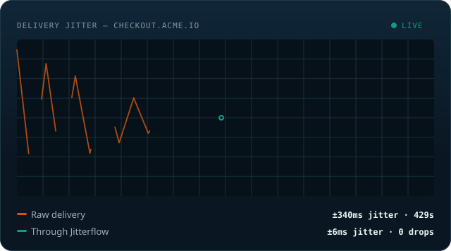

<a href="https://jitterflow.io">
  
</a>

<p align="center">
  <a href="https://jitterflow.io/signup"></a>
</p>

<p align="center">
  <a href="https://jitterflow.io">Website</a> ·
  <a href="https://jitterflow.io/docs">Docs</a> ·
  <a href="https://jitterflow.io/pricing">Pricing</a> ·
  <a href="https://jitterflow.io/changelog">Changelog</a> ·
  <a href="https://jitterflow.io/status">Status</a>
</p>

<p align="center">
  <a href="https://www.npmjs.com/package/n8n-nodes-jitterflow"></a>
  <a href="https://www.npmjs.com/package/n8n-nodes-jitterflow"></a>
</p>

<br />

Point your outbound webhooks at Jitterflow instead of the final
destination. Bursts get spread out, failures get retried with backoff, and
nothing disappears.

<br />

<p align="center">
  
</p>

<br />

## 🚀 Quickstart

```bash
curl -X POST https://jitterflow.io/v1/ingest/YOUR_ENDPOINT_KEY \
  -H "Authorization: Bearer YOUR_API_KEY" \
  -H "Content-Type: application/json" \
  -d '{ "payload": { "event": "user.created", "userId": "u_123" } }'
```

```json
202 Accepted
{ "jobId": "9c7e21a4-...", "scheduledFor": "2026-08-22T14:32:07.000Z", "status": "DELAYED" }
```

That's it — no infrastructure to run, no queue to manage. Jitterflow paces
the delivery, retries on failure, and keeps a dead-letter queue for
anything that doesn't make it.

**[Get started free →](https://jitterflow.io/signup)** The Developer plan is free with no end date and never asks for a card.

<sub>Your API key is shown once and never stored in plaintext — only its
bcrypt hash is kept. Rotating it gives your old key a 24-hour grace window,
or revoke it instantly if it was exposed.</sub>

<br /><br />

## 💡 Why teams use it

| | |
|---|---|
| 🚦 **Stop triggering 429s** | Outbound bursts get spread across a computed delay window instead of hammering the receiver all at once. |
| 🪝 **Never lose a failed webhook again** | Deliveries that exhaust every retry land in a hosted dead-letter queue you can inspect, retry, or resolve. |
| 🧱 **One dead endpoint can't take the rest down** | Dispatch is isolated per destination, so a slow or hanging receiver never backs up your other targets. |
| 🛡️ **Ships clean through a security review** | SSRF-safe destination validation on every request, secrets encrypted at rest, and Standard Webhooks-compliant signing (`svix-*` headers) on every delivery. |
| ⚡ **Up and running in minutes** | Sign in with GitHub — no email round-trip — and ship with `@jitterflow/sdk-node`, a typed client for endpoints, ingest, and the DLQ. |

<br /><br />

## 📚 Docs & resources

| Resource | What's there |
|---|---|
| **[Documentation](https://jitterflow.io/docs)** | Quickstart, API reference, and integration guides |
| **[Pricing](https://jitterflow.io/pricing)** | Free Developer plan with no end date (10,000 webhooks/mo, 3 endpoints, no card). Paid plans from $19 up to 10M/mo on Scale |
| **[n8n integration](https://jitterflow.io/integrations/n8n)** | Send and manage delivery from inside a workflow |
| **[Compare](https://jitterflow.io/compare)** | Jitterflow vs Svix, Hookdeck and Convoy, every claim sourced |
| **[Changelog](https://jitterflow.io/changelog)** | What shipped, and when |
| **[Status](https://jitterflow.io/status)** | Live uptime and incident history |

<br />

## 🧰 Free tools, no login

| Tool | What it does |
|---|---|
| **[Rate limits directory](https://jitterflow.io/limits)** | Published API and webhook rate limits for 33 services, with a pacing calculator for each |
| **[Webhook signature verifier](https://jitterflow.io/webhooks)** | Check a signature in your browser for Stripe, GitHub, Shopify and 12 more providers |
| **[Webhook failure simulator](https://jitterflow.io/tools/webhook-failure-simulator)** | A live URL that returns 429s, 500s, timeouts and dropped connections on demand |
| **[Backoff & jitter calculator](https://jitterflow.io/tools/backoff-calculator)** | See every retry time for exponential backoff with full, equal or decorrelated jitter |
| **[Retry-After parser](https://jitterflow.io/tools/retry-after-parser)** | Paste a 429 response and see exactly when you can retry |
| **[HMAC generator](https://jitterflow.io/tools/hmac-generator)** | Sign or verify any payload with SHA-256, SHA-1 or SHA-512 |
| **[Jitter calculator](https://jitterflow.io/tools/jitter-calculator)** | Estimate the delay window you need for your own rate limits |

<br />

## 🎯 Who it's for

- **Platforms** sending webhooks to their own customers at real scale
- **Teams** integrating with third-party APIs that enforce strict rate limits
- **Automation builders** on n8n, Make, Zapier, Vapi, Retell, or any webhook-sending tool — n8n ships as a [native node](https://jitterflow.io/integrations/n8n)

<br />

Questions before you integrate? **[Talk to us →](https://jitterflow.io/contact)**

<br /><br />

<p align="center">
  <a href="https://jitterflow.io"><b>jitterflow.io →</b></a>
</p>
